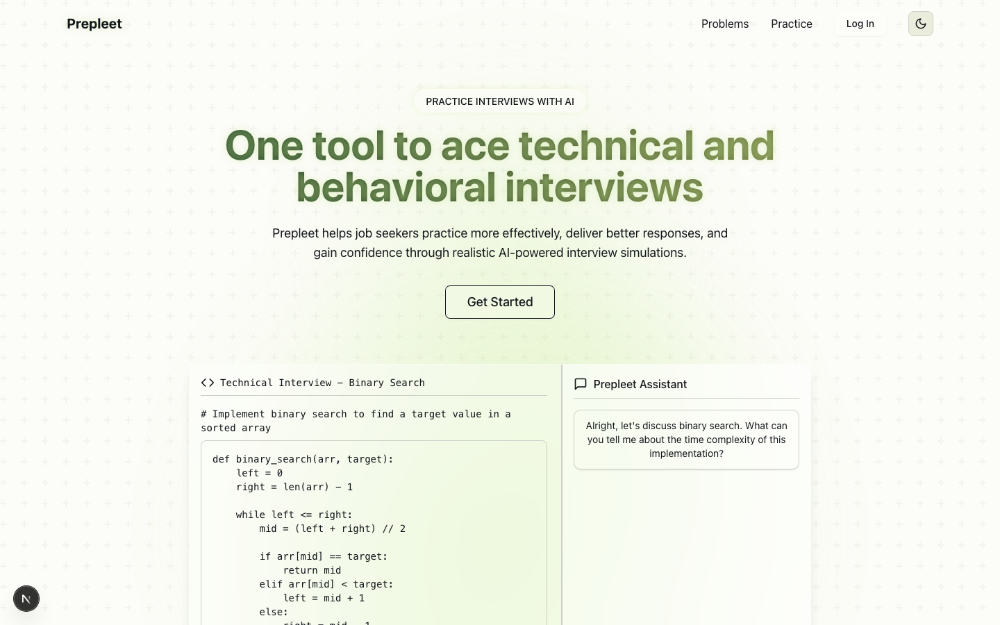
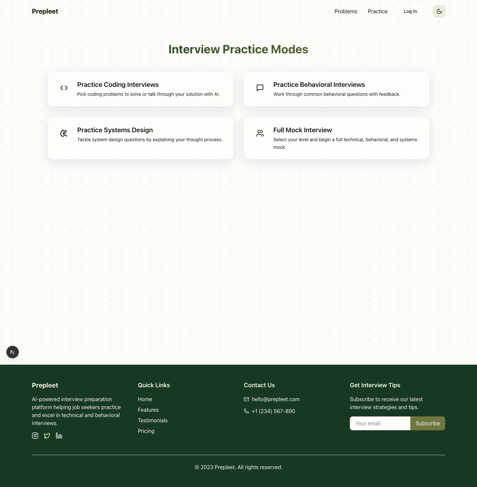
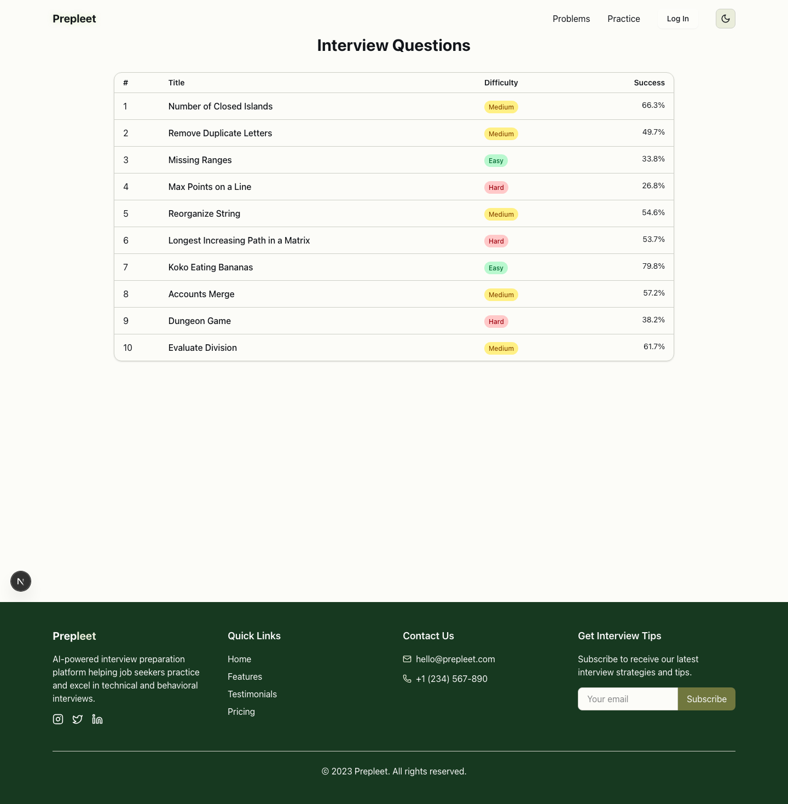
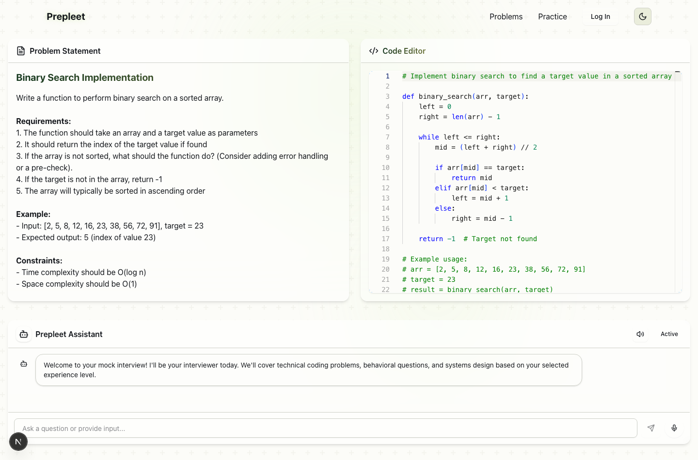

# Prepleet

## What This Is

Prepleet is an interview-practice frontend built around simulated technical, behavioral, systems, and full mock interview flows. The repo includes a marketing landing page, a practice-mode selector, a question bank, and a full mock-interview screen with code, chat, and resizable panels.

## Preview









## What Works

- Landing page with interview-prep messaging and a split-screen product mock
- Practice-mode menu for coding, behavioral, systems, and full mock flows
- Full mock interview screen with:
  - Monaco code editor
  - problem statement panel
  - assistant chat panel
  - resizable horizontal and vertical splits
  - microphone and text-to-speech UI controls
- Question bank view with interview-question metadata
- Theme support across the main frontend surfaces

## How It's Built

- Next.js app-router frontend under `src/app`
- Reusable UI primitives under `src/components/ui`
- Framer Motion and custom layout behavior inside the full mock screen
- Monaco Editor integration for coding-interview practice
- Theme and shared utilities under `src/lib`

## Technical Notes

- The strongest implemented surface is the full mock screen, which combines a problem panel, code editor, and interviewer chat into one workspace instead of treating practice as a plain chat app.
- The repo is frontend-heavy by design. The interview UI and interaction model are the main artifact here, with backend integration represented by a local interview API call from the full mock screen.
- The landing page is not the whole project; the app includes multiple navigable practice surfaces inside `src/app`.

## Proof of Work

- Landing page in [src/app/page.tsx](./src/app/page.tsx)
- Practice menu in [src/app/practice/page.tsx](./src/app/practice/page.tsx)
- Full mock interview workspace in [src/app/practice/full/page.tsx](./src/app/practice/full/page.tsx)
- Question bank in [src/app/problems/page.tsx](./src/app/problems/page.tsx)
- Screenshots checked into [docs/assets](./docs/assets)

## Run Locally

```bash
npm install
npm run dev
```

Then open `http://localhost:3000`.

## Backend Note

The full mock interview page calls a local interview API at `POST http://localhost:5000/interview`. That boundary is isolated to the assistant-response flow, so the main frontend surfaces can still be reviewed without standing up the backend.
